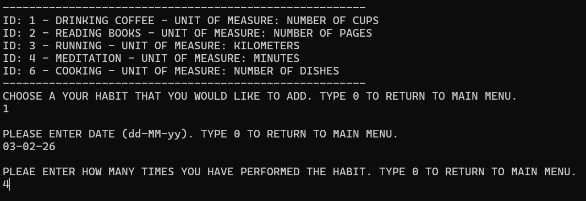
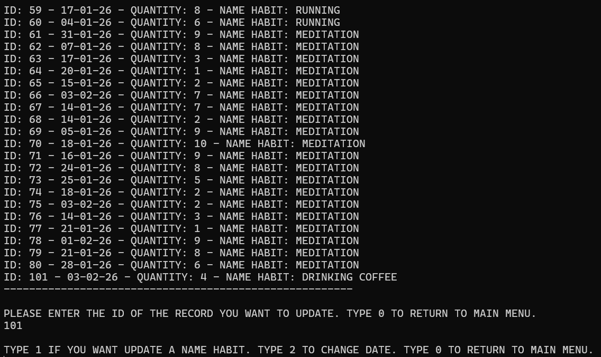
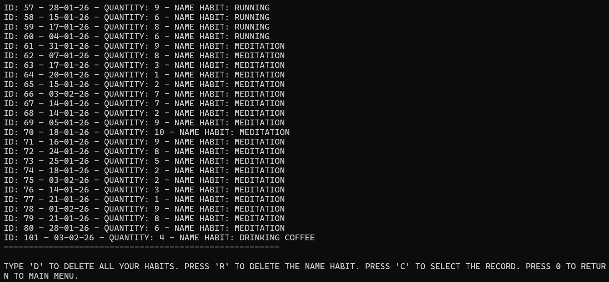
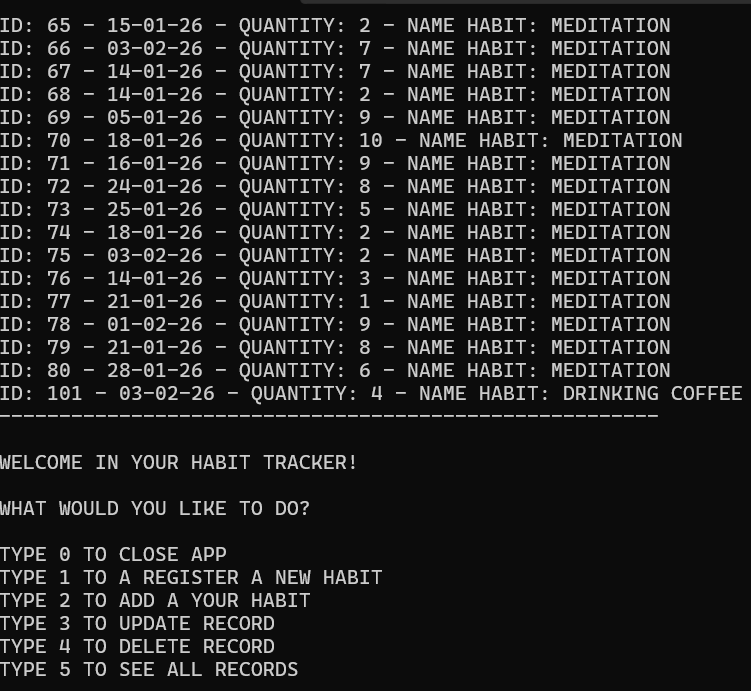

# HABIT-TRACKER

Questa è la mia prima applicazione C# con l'utilizzo di Sqlite come database per tracciare le abitudini quotidiane.

Essa è un'applicazione CRUD (Create, Read, Update, Delete) che permette agli utenti di monitorare e gestire le loro abitudini giornaliere.

## Requisiti di progetto

- Questa applicazione darà la possibilità di registrare le abitudini quotidiane.
- Le abitudini aggiunte saranno gestite solo in termini di quantità.
- L'applicazione permetterà di aggiungere, visualizzare, modificare ed eliminare le abitudini.
- L'applicazione utilizzerà Sqlite come database per memorizzare le abitudini.
- All'avvio dell'applicazione, verrà creato un database Sqlite se non esiste già.
- All'avvio dell'applicazione, se non esiste già, verranno generate alcune abitudini predefinite per facilitare i test.
- L'applicazione è in grado di gestire tutti i possibili errori cosicché non si possa mai bloccare.
- La comunicazione con il database è gestita con ADO.NET.

## Caratteristiche

- Connessione al database
	-	Il programma utilizza una connessione al databse SQlite per memorizzare e leggere le informazioni.
	-	Se non esiste all'avvio, verrà creato un database con delle abitudini random per i test.

- L'interfaccia utente, basata su console, è semplice e intuitiva

- Funzioni CRUD
	-	Dal menù si possono creare, leggere, aggiornare e cancellare le abitudini registrate.

- Registrazione e inserimento
	-	Digitando '1', si registra una nuova abitudine. Bisogna inserire il nome dell'abitudine e l'unita di misura.
	-	  
	-	Digitando '2', si aggiungono le abitudini inserendo la data e la quantità.
	-	
	-	L'applicazione permette di tornare sempre al menù principale. Controlla che l'input della data sia nel formato corretto (dd-MM-yy). Controlla che nelle quantità siano inseriti solo numeri.

- Update record
	-	Digitando '3', si possono aggiornare le abitudini.
	-	
	-	Il programma da la possibilità di cambiare il nome dell'abitudine; solo la data o tornare nel menù prinipale.

- Delete record
	-	Digitando '4', si possono eliminare le abitudini.
	-	
	-	 Il programma da la possibilità di eliminare tutto; di eliminare solo i record di una precisa abitudine; selezionare una sola abitudine o tornare indietro.

- See all records
	-	Digitando '5', si possono visualizzare tutte le abitudini registrate. 
	-	

